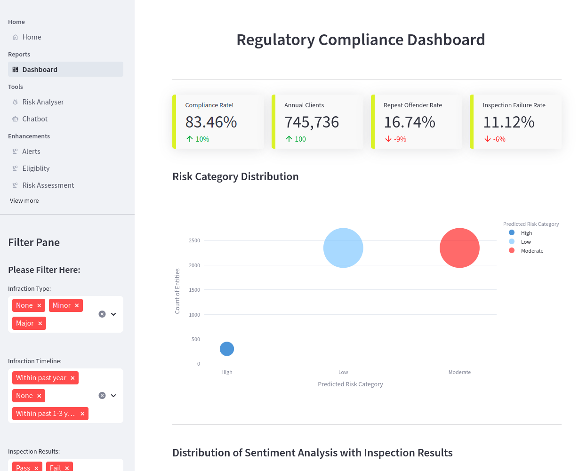
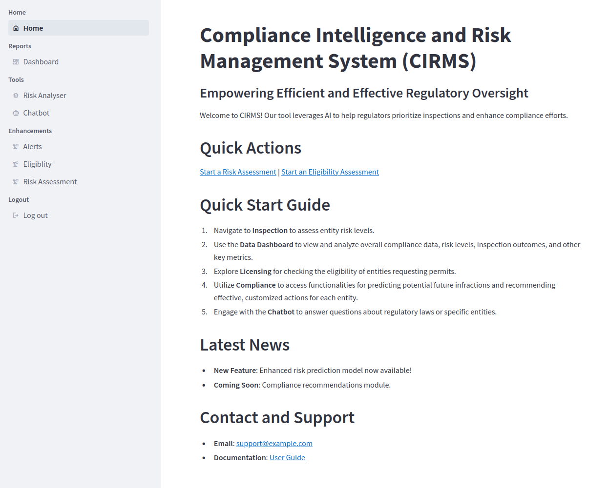
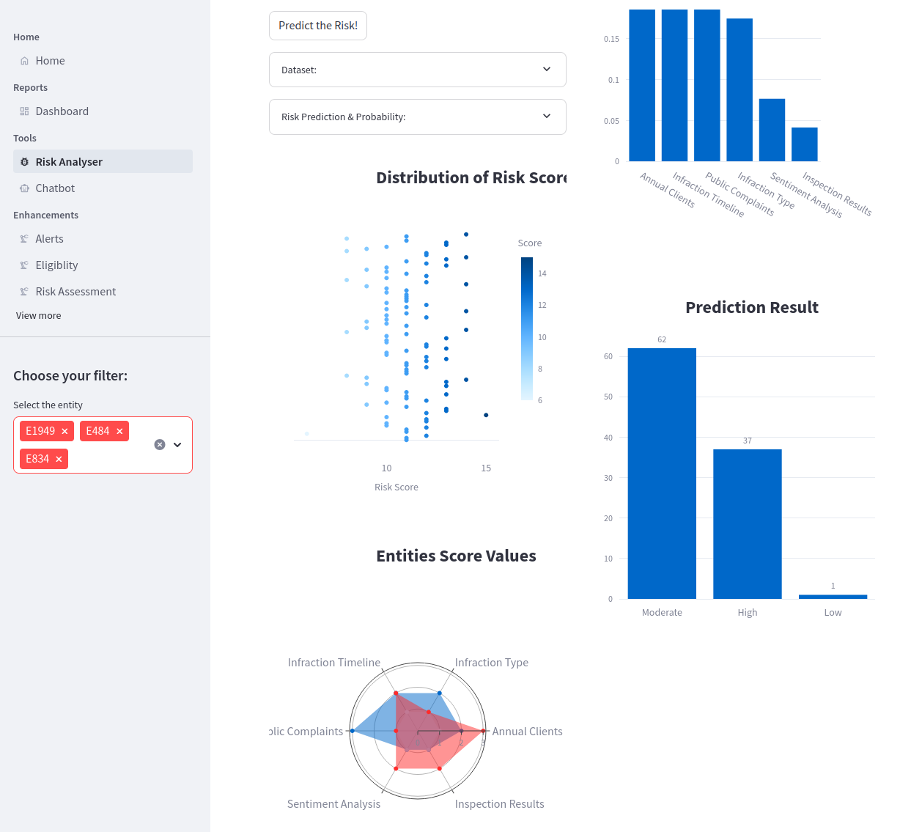

# Regulatory Intelligence Solution Prototype

## Overview
Welcome to the Regulatory Intelligence Solution Prototype. This project aims to create a user-friendly risk-based predictive modeling tool using Artificial Intelligence to help regulators determine which regulated entities are at higher risk of non-compliance with regulations. This prototype is developed to prioritize inspector resources based on risk levels, predict specific infractions, and recommend regulatory interventions to improve compliance effectiveness.

You can access the application here: [Regulatory Intelligence Solution Prototype](https://m2m-regulatory.streamlit.app)







## Table of Contents
- [Project Purpose](#project-purpose)
- [Client Challenge](#client-challenge)
- [Key Tasks](#key-tasks)
- [Getting Started](#getting-started)
- [Technical Steps](#technical-steps)
- [How to Use](#how-to-use)
- [Data Preparation](#data-preparation)
- [Contributing](#contributing)
- [License](#license)

## Project Purpose
The purpose of this prototype is to:
1. **Phase 1:** Prioritize inspections based on risk (low, medium, high) to determine which entity to inspect.
2. **Phase 2:** Predict specific infractions to investigate.
3. **Phase 3:** Recommend regulatory interventions/measures to support non-compliant entities achieve compliance.

## Client Challenge
The regulator must conduct inspections across 5,000 licensed entities and needs to prioritize limited inspector resources. The solution will help:
1. Determine which entity to inspect.
2. Investigate specific infractions.
3. Support non-compliant entities to achieve compliance.

## Key Tasks
The development is undertaken in a phased approach with client reviews after each phase.

### Phase 1
1. Establish the data structure:
    - Number of clients served annually.
    - Past infraction history type and timeline.
    - Public complaints in the last quarter.
    - Quarterly public sentiment analysis.
    - Previous inspection results.
2. Develop a risk model.
3. Create dummy data for 5,000 entities.
4. Build the risk-based model and visualization dashboard.
5. Develop data ingestion approach.
6. Create an AI model to predict risk more effectively.
7. Establish an effective user interface.

## Getting Started
### Prerequisites
- Python 3.10
- Streamlit
- Pandas
- Scikit-learn
- Poetry

### Installation
#### Downgrade to Python 3.10
```bash
sudo apt-get install python3.10
```

#### Activate Virtual Environment
```bash
python3.10 -m venv myenv
source myenv/bin/activate
```

#### Loading Packages using Poetry
##### Install pipx
```bash
sudo apt install pipx
```
##### Install poetry
```bash
pipx install poetry
poetry install
```
##### Update PATH
```bash
export PATH="/home/<user>/.local/bin:$PATH"
```
##### (Optional) Add modules from requirements.txt
```bash
poetry add $(cat requirements.txt)
```

### Running the App
To run the Streamlit app, use the following command:
```bash
streamlit run app.py
```

## Technical Steps
1. **Data Structure Establishment:**
   - Define and structure the data attributes such as client count, infraction history, complaints, sentiment analysis, and inspection results.
2. **Risk Model Development:**
   - Assign risk scores based on the attributes.
   - Calculate total risk score and categorize into low, moderate, and high risk.
3. **Dummy Data Creation:**
   - Generate data for 5,000 entities to simulate real-world scenarios.
4. **Model and Dashboard Building:**
   - Develop a dashboard to visualize the risk scores and provide drill-down capabilities.
5. **Data Ingestion Approach:**
   - Enable quarterly data updates into the tool.
6. **AI Model Creation:**
   - Implement a machine learning model to predict risk more accurately.
7. **User Interface Establishment:**
   - Develop and test a user-friendly interface.

## How to Use
1. **Non-Technical Summary:**
   - Open the web app to view the risk assessment dashboard.
   - Explore the risk scores and details of each entity.
   - Utilize the drill-down feature to get specific insights into the entities.

2. **Technical Steps:**
   - Follow the installation instructions.
   - Run the app using Streamlit.
   - Use the app to upload new data and visualize the risk assessments.

## Data Preparation
The following steps are taken to generate synthetic data that mirrors the structure and characteristics of the real data you would expect to encounter.

### Step 1: Define the Data Schema
| Entity ID | Annual Clients | Infraction Type | Infraction Timeline | Public Complaints | Sentiment Analysis | Inspection Results | Total Risk Score |
|-----------|----------------|-----------------|---------------------|-------------------|---------------------|--------------------|------------------|
| E0001     | 150            | Minor           | Within past year    | Major             | Flagged             | Pass               | 12               |

### Step 2: Define Value Ranges and Probabilities
1. **Number of Clients Served Annually:**
   - Less than 200 (40%)
   - 201-500 (30%)
   - Greater than 500 (30%)
2. **Past Infraction History Type:**
   - None (50%)
   - Minor (30%)
   - Major (20%)
3. **Past Infraction History Timeline:**
   - None (50%)
   - Within past year (25%)
   - Within past 1-3 years (25%)
4. **Public Complaints in Last Quarter:**
   - None (60%)
   - Minor (25%)
   - Major (15%)
5. **Quarterly Public Sentiment Analysis:**
   - None (70%)
   - Flagged (30%)
6. **Previous Inspection Results:**
   - Pass (50%)
   - Fail (25%)
   - None (25%)

### Step 3: Create Synthetic Data Using Python
Refer to the notebook: [SyntheticData.ipynb](Data/SyntheticData.ipynb)

### Step 4: Verify the Synthetic Data
- Review Distributions: Ensure the distributions of values match the expected probabilities.
- Check Risk Scores: Verify that the risk scores are calculated correctly based on the defined rules.
- Sample Validation: Manually inspect a few samples to ensure data integrity.

## Contributing
We welcome contributions to enhance the project. Please fork the repository and submit pull requests.

## License
This project is licensed under the MIT License. See the LICENSE file for details.

